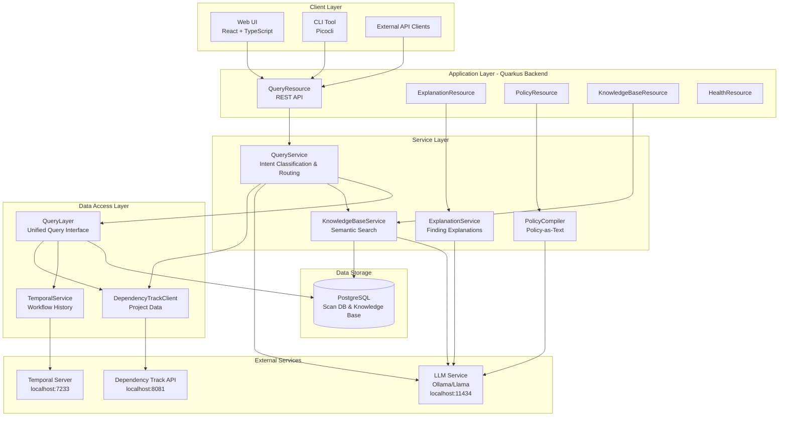
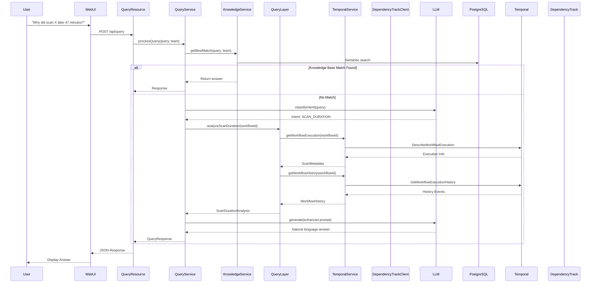
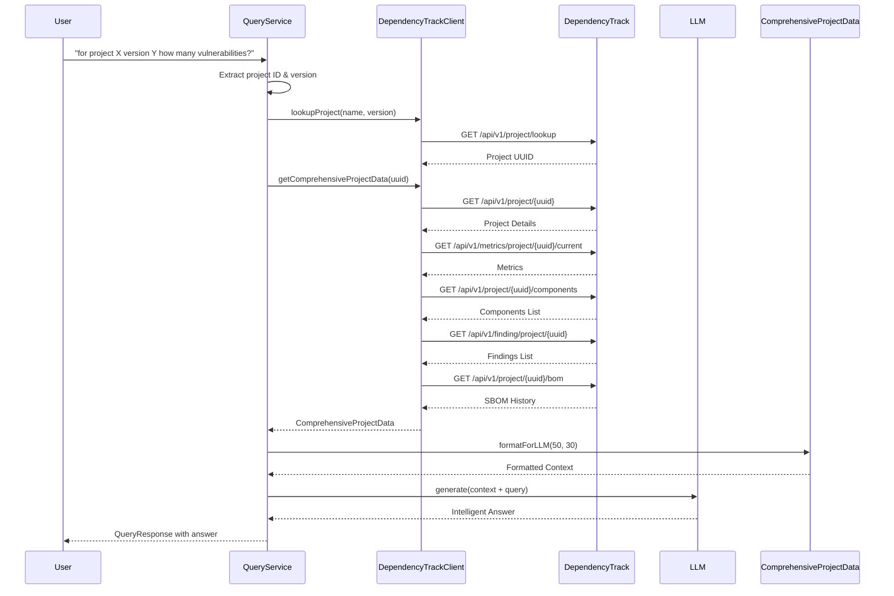
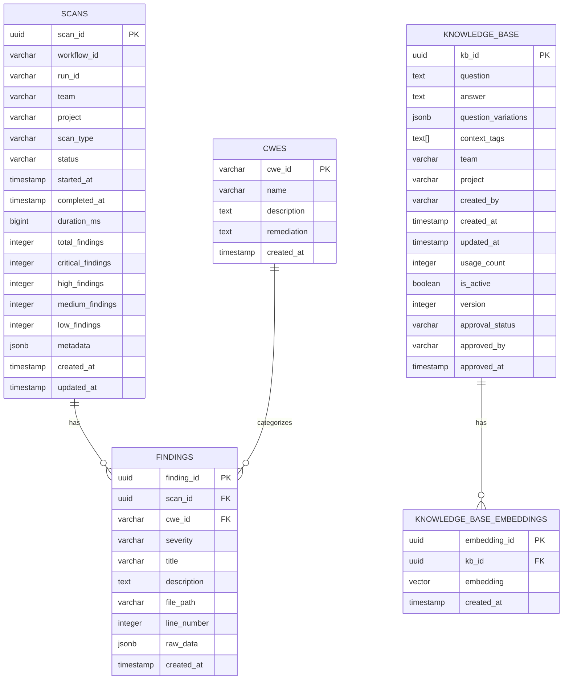
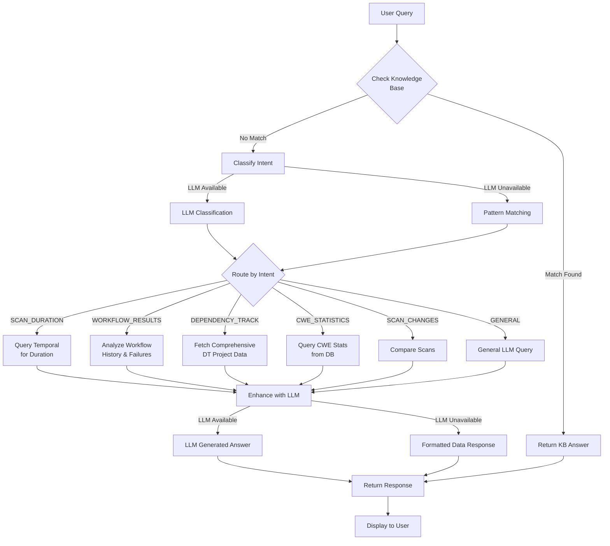
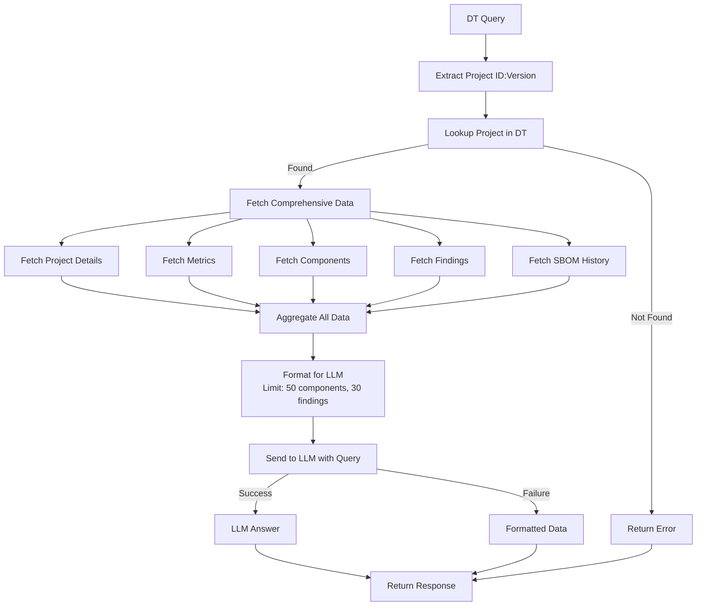
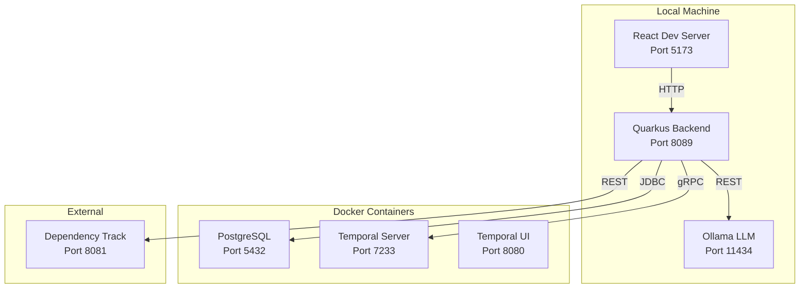

# Temporal Security Analyst - Architecture Documentation

## Table of Contents

1. [System Overview](#system-overview)
2. [Architecture Diagrams](#architecture-diagrams)
3. [Component Details](#component-details)
4. [Data Flow](#data-flow)
5. [Database Schema](#database-schema)
6. [API Endpoints](#api-endpoints)
7. [Integration Points](#integration-points)
8. [Technology Stack](#technology-stack)

---

## System Overview

The Temporal Security Analyst is a natural language security analyst interface that provides intelligent querying over security scan data, Temporal workflow history, Dependency Track project data, finding explanations, policy compilation, and a knowledge base system.

### Key Capabilities

- **Natural Language Queries**: Ask questions about scans, findings, workflows, and security metrics in plain English
- **Workflow Analysis**: Query Temporal workflow execution history and analyze failures
- **Dependency Track Integration**: Comprehensive project vulnerability analysis
- **Finding Explanations**: Transform raw scan tool output into developer-friendly explanations
- **Policy Compiler**: Convert natural language policies into executable rules
- **Knowledge Base**: Organizational Q&A pairs with semantic search
- **Multi-Interface**: REST API, CLI, and Web UI

---

## Architecture Diagrams

### High-Level System Architecture

### Component Interaction Flow

### Dependency Track Query Flow

### Database Schema

---

## Component Details

### 1. Query Service (`QueryService.java`)

**Purpose**: Central orchestrator for natural language queries

**Responsibilities**:
- Intent classification (LLM or pattern-based fallback)
- Query routing to appropriate handlers
- Project ID/version extraction from queries
- Response generation with LLM enhancement

**Intent Types**:
- `SCAN_DURATION` - Questions about scan execution time
- `SCAN_CHANGES` - Questions about differences between scans
- `CWE_STATISTICS` - Questions about CWE counts and trends
- `FINDING_EXPLANATION` - Questions asking to explain findings
- `POLICY_QUERY` - Questions about policies
- `WORKFLOW_RESULTS` - Questions about workflow execution outcomes
- `DEPENDENCY_TRACK` - Questions about Dependency Track projects
- `GENERAL` - Other questions

**Key Methods**:
- `processQuery(String query, String team)` - Main entry point
- `handleDependencyTrackQuery(String query)` - DT project queries
- `handleWorkflowResultsQuery(String query, String team)` - Workflow analysis
- `classifyIntentByPattern(String query)` - Fallback intent classification

### 2. Query Layer (`QueryLayer.java`)

**Purpose**: Unified interface over PostgreSQL and Temporal history

**Responsibilities**:
- Database queries for scans, findings, CWEs
- Temporal workflow history queries
- Dependency Track project queries
- Data aggregation and analysis

**Key Methods**:
- `analyzeScanDuration(String workflowId, String runId)` - Analyze scan execution time
- `analyzeWorkflowResults(String workflowId, String runId)` - Comprehensive workflow analysis
- `getTopCwesByTeam(String team, Instant startTime, Instant endTime, int limit)` - CWE statistics
- `getChangesSinceLastGreenRun(String team)` - Compare scans
- `getProjectByIdentifier(String projectId, String version)` - DT project lookup
- `getProjectVulnerabilities(String projectUuid)` - DT vulnerability metrics
- `getLastSbomUpload(String projectUuid)` - DT SBOM history

### 3. Temporal Service (`TemporalService.java`)

**Purpose**: Integration with Temporal SDK for workflow history

**Responsibilities**:
- Temporal client initialization and management
- Workflow execution queries
- Workflow history retrieval
- Failure analysis and error extraction

**Key Methods**:
- `getWorkflowExecution(String workflowId, String runId)` - Get execution details
- `getWorkflowHistory(String workflowId, String runId)` - Get full history
- `extractScanMetadata(String workflowId, String runId)` - Extract scan metadata
- `extractDetailedFailureInfo(Failure failure)` - Parse failure details

**Failure Analysis**:
- Extracts error messages, stack traces, cause chains
- Identifies failed activities and timeouts
- Analyzes workflow execution status

### 4. Dependency Track Client (`DependencyTrackClient.java`)

**Purpose**: Integration with Dependency Track API for project vulnerability analysis

**Responsibilities**:
- Project lookup by name/version
- Comprehensive project data fetching
- Components, findings, and metrics retrieval
- SBOM history queries
- Data formatting for LLM context

**Key Methods**:
- `lookupProject(String name, String version)` - Find project
- `getComprehensiveProjectData(UUID projectUuid)` - Fetch all project data
- `getProjectComponents(UUID projectUuid)` - Get components list
- `getProjectFindings(UUID projectUuid)` - Get findings/vulnerabilities
- `getProjectMetrics(UUID projectUuid)` - Get vulnerability metrics
- `getBomHistory(UUID projectUuid)` - Get SBOM upload history

**ComprehensiveProjectData**:
- Aggregates: project details, metrics, components, findings, SBOM history
- `formatForLLM(int maxComponents, int maxFindings)` - Formats data for LLM
- Limits data to prevent token overflow (50 components, 30 findings)
- Sorts findings by severity for prioritization

### 5. LLM Client (`LlmClient.java`)

**Purpose**: Interface to self-hosted LLM (Ollama/Llama)

**Responsibilities**:
- Text generation/completion
- Embedding generation for semantic search
- Intent classification
- Graceful degradation when LLM unavailable

**Key Methods**:
- `generate(String prompt)` - Generate text response
- `generateEmbedding(String text)` - Generate embeddings
- `classifyIntent(String query)` - Classify query intent

**Graceful Degradation**:
- Returns default responses if LLM unavailable
- Falls back to pattern-based classification
- Logs warnings but doesn't crash

### 6. Knowledge Base Service (`KnowledgeBaseService.java`)

**Purpose**: Manage organizational Q&A pairs with semantic search

**Responsibilities**:
- Store and retrieve knowledge base entries
- Semantic search using embeddings
- Keyword search fallback
- Usage tracking and statistics

**Key Methods**:
- `getBestMatch(String query, String team)` - Find matching Q&A
- `createEntry(KnowledgeBase entry)` - Create new entry
- `incrementUsageCount(UUID kbId)` - Track usage
- `generateEmbedding(String text)` - Create embeddings

**Search Strategy**:
1. Try semantic search with embeddings
2. Fallback to keyword search if embeddings unavailable
3. Return best match with similarity score

### 7. Explanation Service (`ExplanationService.java`)

**Purpose**: Transform raw scan tool output into developer-friendly explanations

**Responsibilities**:
- Parse finding data
- Generate explanations using LLM
- Extract code pointers and remediation steps
- Format for developer consumption

### 8. Policy Compiler (`PolicyCompiler.java`)

**Purpose**: Convert natural language policies into executable rules

**Responsibilities**:
- Parse natural language policy text
- Generate rule conditions and actions
- Create executable rule code
- Validate policy syntax

---

## Data Flow

### Natural Language Query Flow

### Dependency Track Comprehensive Query Flow

---

## Database Schema

### Tables Overview

1. **scans** - Security scan executions
   - Links to Temporal workflows via `workflow_id` and `run_id`
   - Stores scan metadata, timing, and finding counts
   - Indexed by team, status, started_at, workflow_id

2. **findings** - Individual security findings
   - Links to scans and CWEs
   - Stores severity, location (file_path, line_number), and raw data
   - Indexed by scan_id and cwe_id

3. **cwes** - CWE definitions
   - Common Weakness Enumeration entries
   - Stores name, description, and remediation guidance

4. **knowledge_base** - Q&A pairs
   - Organizational knowledge entries
   - Supports versioning, approval workflow, and usage tracking
   - Array of context tags for categorization

5. **knowledge_base_embeddings** - Vector embeddings
   - Stores embeddings for semantic search
   - Links to knowledge_base entries

### Migration Management

- Uses Liquibase for schema versioning
- Idempotent changesets with preconditions
- Automatic migration on application startup
- Validation enabled for safety

---

## API Endpoints

### Query Endpoints

**POST** `/api/query`
- Process natural language queries
- Request: `{ "query": "...", "team": "..." }`
- Response: `{ "source": "...", "answer": "...", "data": {...}, "confidence": 0.95 }`

### Explanation Endpoints

**GET** `/api/explanation/finding/{findingId}`
- Get developer-friendly finding explanation
- Returns: explanation, steps to reproduce, code pointers, impact, recommended fix

### Policy Endpoints

**POST** `/api/policy/compile`
- Compile natural language policy to executable rules
- Request: `{ "policy": "..." }`
- Response: `{ "originalPolicy": "...", "action": "...", "condition": "...", "ruleCode": "..." }`

### Knowledge Base Endpoints

**POST** `/api/knowledge`
- Create new Q&A entry
- Request: `{ "question": "...", "answer": "...", "createdBy": "...", "team": "...", "contextTags": [...] }`

**POST** `/api/knowledge/search`
- Search knowledge base
- Request: `{ "query": "...", "team": "...", "limit": 5 }`

**GET** `/api/knowledge/{id}`
- Get specific knowledge base entry

**PUT** `/api/knowledge/{id}`
- Update knowledge base entry

**DELETE** `/api/knowledge/{id}`
- Delete knowledge base entry

### Health Endpoints

**GET** `/api/health`
- Application health check

---

## Integration Points

### 1. Temporal Integration

**Connection**: gRPC to Temporal server (default: `localhost:7233`)

**Capabilities**:
- Query workflow execution details
- Retrieve workflow history
- Analyze workflow failures
- Extract scan metadata from workflow memos/search attributes

**Use Cases**:
- "Why did scan X take 47 minutes?"
- "What happened on workflow Y?"
- "Why did the last workflow fail?"

### 2. Dependency Track Integration

**Connection**: REST API (default: `http://localhost:8081`)

**Authentication**: API Key via `X-Api-Key` header

**Endpoints Used**:
- `GET /api/v1/project/lookup` - Find project by name/version
- `GET /api/v1/project/{uuid}` - Get project details
- `GET /api/v1/metrics/project/{uuid}/current` - Get metrics
- `GET /api/v1/project/{uuid}/components` - Get components
- `GET /api/v1/finding/project/{uuid}` - Get findings
- `GET /api/v1/project/{uuid}/bom` - Get SBOM history

**Use Cases**:
- "For project X version Y, how many vulnerabilities?"
- "What is the highest severity for project X?"
- "When was last SBOM uploaded?"

### 3. LLM Integration

**Connection**: REST API to Ollama (default: `http://localhost:11434`)

**Endpoints Used**:
- `POST /api/generate` - Text generation
- `POST /api/embeddings` - Embedding generation

**Models**: Configurable (default: `mistral:7b-instruct`)

**Graceful Degradation**: Falls back to pattern matching and keyword search when LLM unavailable

### 4. PostgreSQL Database

**Connection**: JDBC (default: `jdbc:postgresql://localhost:5432/temporal_ai`)

**User**: `temporal` / Password: `temporal`

**Features**:
- Hibernate ORM with Panache for entity management
- Liquibase for schema migrations
- JSONB support for flexible metadata storage
- Vector support for embeddings (via pgvector extension)

---

## Technology Stack

### Backend

- **Java 21** - Programming language
- **Quarkus 3.6.0** - Cloud-native Java framework
- **Maven** - Build tool
- **Hibernate ORM + Panache** - Database ORM
- **Liquibase** - Database migrations
- **PostgreSQL** - Database
- **Temporal SDK 1.22.0** - Workflow orchestration client
- **Picocli** - CLI framework
- **Jackson** - JSON processing

### Frontend

- **React** - UI framework
- **TypeScript** - Type-safe JavaScript
- **Vite** - Build tool
- **Material-UI (MUI)** - Component library
- **React Query (TanStack Query)** - Data fetching

### External Services

- **Ollama/Llama** - Self-hosted LLM
- **Temporal** - Workflow orchestration
- **Dependency Track** - Software supply chain security

### Infrastructure

- **Docker & Docker Compose** - Containerization
- **PostgreSQL** - Database server

---

## Deployment Architecture

### Local Development

### Production (Openshift ECS)

- Backend deployed as containerized Quarkus application
- Frontend built as static assets, served via CDN or nginx
- PostgreSQL as managed service
- Temporal as managed service
- LLM service accessible via internal network
- Dependency Track accessible via internal network

---

## Security Considerations

1. **API Authentication**: Currently not implemented (add for production)
2. **Database Credentials**: Stored in configuration (use secrets management)
3. **LLM API**: No authentication required (consider for production)
4. **CORS**: Configured for specific origins
5. **Input Validation**: Implemented for API endpoints
6. **SQL Injection**: Protected via Hibernate parameterized queries

---

## Performance Considerations

1. **LLM Timeout**: 90 seconds default (configurable)
2. **Database Connection Pooling**: Managed by Quarkus Agroal
3. **Query Limits**: Dependency Track queries limited to 50 components, 30 findings
4. **Graceful Degradation**: System continues operating if LLM unavailable
5. **Caching**: Knowledge base embeddings cached in database
6. **Pagination**: Consider for large result sets

---

## Monitoring & Observability

1. **Logging**: Quarkus logging with configurable levels
2. **Health Checks**: `/api/health` endpoint
3. **Metrics**: Quarkus Micrometer integration (can be enabled)
4. **Tracing**: OpenTelemetry support (can be enabled)

---

## Future Enhancements

1. **Authentication & Authorization**: Add user management and RBAC
2. **Caching Layer**: Redis for frequently accessed data
3. **Event Streaming**: Kafka for real-time updates
4. **Advanced Analytics**: Time-series analysis for trends
5. **Multi-LLM Support**: Support multiple LLM providers
6. **Workflow Integration**: Create Temporal workflows for automated analysis
7. **Notification System**: Alert on critical findings
8. **Dashboard**: Enhanced visualization and reporting

---

## Conclusion

The Temporal Security Analyst provides a comprehensive natural language interface for security analysis, combining multiple data sources (PostgreSQL, Temporal, Dependency Track) with LLM-powered intelligence to deliver actionable insights to security teams and developers.

